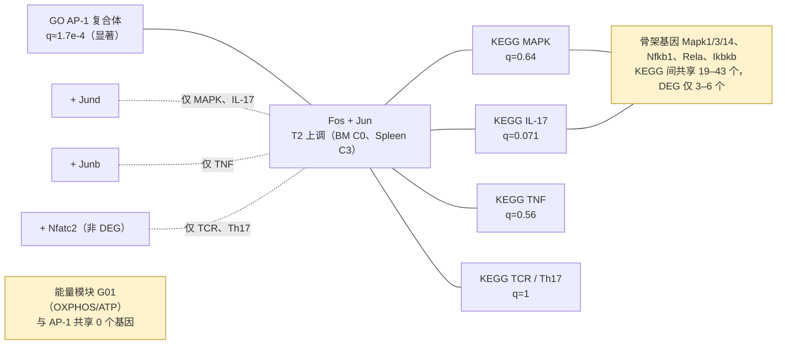

# 桥接基因（Bridge Genes: Fos, Jun）

> 在基因层面，AP-1 与 KEGG MAPK / IL-17 / TCR / Th17 / TNF 之间唯一有差异表达支持的“桥”是 Fos + Jun，再加 Jund / Junb / Nfatc2 之一（视通路对而定）。

## 定义

桥接基因（bridge gene）：同时属于两个锚点通路的基因。它只有在**也是差异表达基因（DEG）**时，才算“数据支持的桥”；否则只是注释重叠。表见 `iNKT_by_date/2026-09-30/drilldown/tables/anchor_bridge_genes.csv`（锚点两两共享基因）与 `iNKT_by_date/2026-09-30/drilldown/tables/bridge_candidate_genes.csv`（候选基因在各通路的成员与 6 个比较的 log2FC）。

## CS 类比

≈ 依赖图里的共享库：两个服务都 import 了 `Fos`，不等于这两个服务在运行时互相调用；只有该库在这次运行里真的“被触发”（DEG）时，才是有证据的耦合。

## 常见误读与注意

- **不是 Fos/Jun/Junb/Jund 四个基因在每一对通路里都是桥。** AP-1 复合体与各 KEGG 通路各共享恰好 3 个基因：MAPK、IL-17 = Fos + Jun + Jund；TNF = Fos + Jun + Junb；TCR、Th17 = Fos + Jun + Nfatc2。其中 Nfatc2 不是 DEG，所以 TCR/Th17 里有 DE 支持的只有 Fos + Jun（2/3）。
- KEGG 五个通路两两共享 19–43 个基因，其中 DEG 只有 3–6 个。共享的多是 MAPK/NF-κB 骨架基因（Mapk1/3/14、Nfkb1、Rela、Ikbkb 等），它们不是 DEG。
- 有些共享 DEG 方向相反：Chuk、Traf2、Akt2、Map2k7、Grb2 在 Spleen C3 下调，而 Fos/Jun 上调。
- Fosb、Dusp1、Nr4a1、Egr1 差异表达很强，但各自至多在一个锚点里，所以不构成桥。
- 能量模块（G01 氧化磷酸化）与 AP-1 共享 0 个基因，与各 KEGG 通路共享 0–3 个基因，且都不是 DEG。
- 这是共成员/注释重叠，不是蛋白相互作用（没有使用 STRING/PPI）。

## 在本项目中

- 数据：Fos 在 BM C0 log2FC +0.93（FDR 2.0e-19）、Spleen C3 +1.78（1.4e-38）；Jun 在 BM C0 +0.61、Spleen C3 +1.24（`iNKT_by_date/2026-09-30/drilldown/tables/anchor_bridge_genes.csv`）。热图见 `iNKT_by_date/2026-09-30/drilldown/figures/bridge_genes_heatmap_v2.png`。
- BM/Spleen C5-2 在这些通路里没有 DEG（`iNKT_by_date/2026-09-30/drilldown/tables/pathway_drill_summary.csv`）。
- **解读（推断，不是文件里的结论）**：T2 特征是即刻早期 AP-1（Fos–Jun）反应；KEGG MAPK / IL-17 等只是因为基因集里包含 Fos/Jun，才与 AP-1“相连”。这既可能是生态位内的真实激活，也可能是组织解离应激，需要台面实验区分（见 [[即刻早期基因与组织解离应激（Immediate-Early Genes, Dissociation Stress）|Immediate-Early-Genes-and-Dissociation-Stress]] 与 [[未决问题与下一步（Open Questions and Next Steps）|Open-Questions-and-Next-Steps]]）。

## 相关概念

- [[锚点节点（Anchor Nodes）|Anchor-Nodes]] — 桥接是在锚点之间定义的。
- [[基因层面钻取（Gene-level Drill-down）|Gene-Level-Drilldown]] — 桥接基因来自的成员表与共成员边。
- [[AP-1 转录因子复合体（AP-1: Fos/Jun family）|AP-1-Fos-Jun]] — Fos、Jun 所属的转录因子。
- [[MAPK 级联（MAPK Cascade: ERK, p38, JNK）|MAPK-Cascade]] — MAPK 骨架基因未见差异表达。
- [[即刻早期基因与组织解离应激（Immediate-Early Genes, Dissociation Stress）|Immediate-Early-Genes-and-Dissociation-Stress]] — 主要替代解释。
- [[混合 GO/KEGG 网络分析（Mixed GO/KEGG Network, 2026-09-30）|Mixed-GO-KEGG-Network-0930]] — 通路层面的答案（依赖方法与 k）。
- [[差异表达（Differential Expression, DE; Wilcoxon）|Differential-Expression]] — DEG 的判定。
