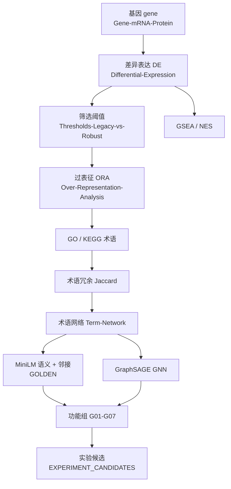
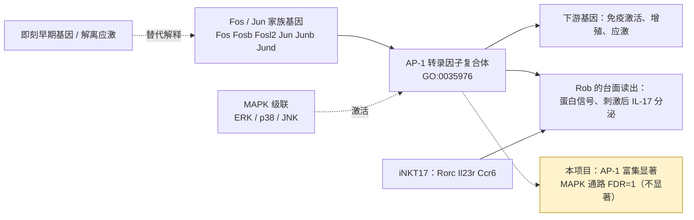
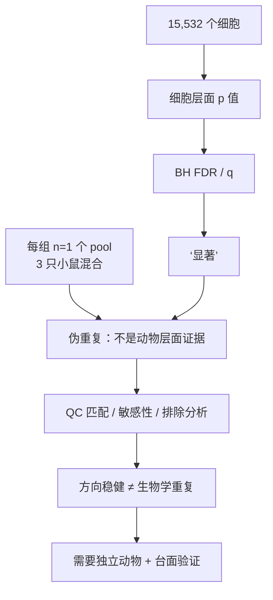
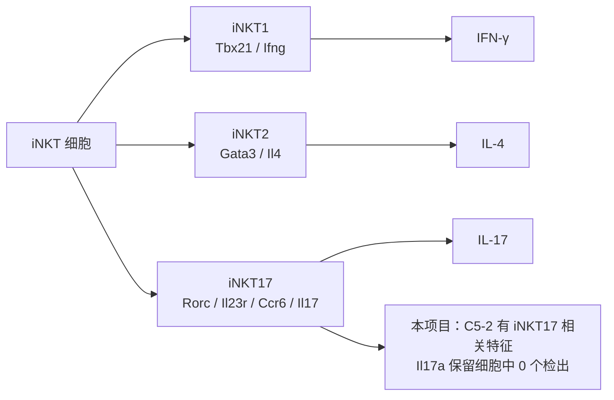
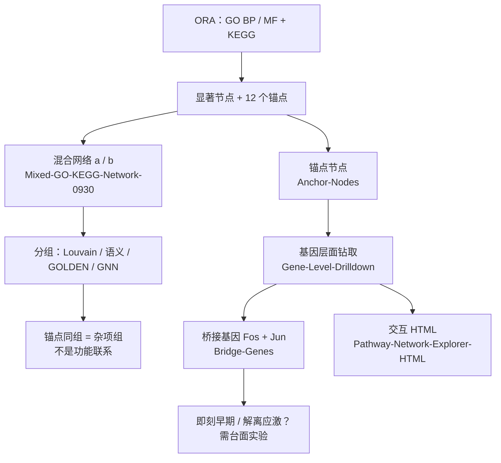

# 概念地图（Concept Map）

Mermaid 图中每个节点都对应一个概念页，下表列出映射。

## 1. 分析主线：基因 → 功能组

## 2. 生物学线：Fos/Jun → AP-1 → MAPK → 台面实验

## 3. 统计与证据边界

## 4. iNKT 亚型与细胞因子

## 5. 09-30：从通路到基因

## 节点 → 页面

| 图中节点 | 页面 |
|---|---|
| 基因 | [[基因、mRNA 与蛋白质（Gene / mRNA / Protein, Central Dogma）|Gene-mRNA-Protein]] |
| DE / 阈值 | [[差异表达（Differential Expression, DE; Wilcoxon）|Differential-Expression]] [[两套筛选阈值：legacy 与 robust（Thresholds: Legacy vs Robust）|Thresholds-Legacy-vs-Robust]] |
| ORA / GSEA | [[过表征分析（Over-Representation Analysis, ORA; hypergeometric test）|Over-Representation-Analysis]] [[基因集富集分析与 NES（Gene Set Enrichment Analysis, GSEA; Normalized Enrichment Score, NES）|GSEA-and-NES]] |
| GO / KEGG | [[基因本体（Gene Ontology, GO: BP / MF / CC）|Gene-Ontology]] [[KEGG 通路数据库（KEGG Pathway Database）|KEGG]] |
| Jaccard 冗余 | [[术语冗余与 Jaccard 相似度（Term Redundancy, Jaccard Index）|Term-Redundancy-and-Jaccard]] |
| 术语网络 / GOLDEN / GNN | [[术语网络（Term Network: nodes = terms, edges = shared genes）|Term-Network]] [[GOLDEN 与融合聚类（GOLDEN, Fusion）|GOLDEN]] [[图神经网络与 GraphSAGE（Graph Neural Network, GraphSAGE）|GraphSAGE-and-GNN]] |
| 功能组 | [[功能组 G01–G07 及含义（Functional Groups G01–G07）|Functional-Groups-G01-G07]] |
| Fos/Jun / AP-1 / MAPK | [[AP-1 转录因子复合体（AP-1: Fos/Jun family）|AP-1-Fos-Jun]] [[MAPK 级联（MAPK Cascade: ERK, p38, JNK）|MAPK-Cascade]] |
| 解离应激 | [[即刻早期基因与组织解离应激（Immediate-Early Genes, Dissociation Stress）|Immediate-Early-Genes-and-Dissociation-Stress]] |
| iNKT 亚型 / 细胞因子 | [[iNKT 亚型 iNKT1 / iNKT2 / iNKT17 及其标志基因（iNKT Subsets and Markers）|iNKT-Subsets]] [[细胞因子（Cytokine: IFN-γ, IL-4, IL-17）|Cytokine]] |
| 伪重复 / QC 匹配 / 敏感性 | [[伪重复与 n=1（Pseudoreplication, Why Cell-level p-values Are Not Animal-level Evidence）|Pseudoreplication-and-n-equals-1]] [[QC 匹配与标准化均值差（QC Matching, SMD）|QC-Matching-and-SMD]] [[敏感性分析（Sensitivity Analysis）|Sensitivity-Analysis]] |
| 台面验证 | [[未决问题与下一步（Open Questions and Next Steps）|Open-Questions-and-Next-Steps]]（`iNKT_by_date/2026-09-25/results/EXPERIMENT_CANDIDATES.md`） |
| 混合网络 / 锚点 | [[混合 GO/KEGG 网络分析（Mixed GO/KEGG Network, 2026-09-30）|Mixed-GO-KEGG-Network-0930]] [[锚点节点（Anchor Nodes）|Anchor-Nodes]] |
| 桥接基因 / 基因钻取 | [[桥接基因（Bridge Genes: Fos, Jun）|Bridge-Genes]] [[基因层面钻取（Gene-level Drill-down）|Gene-Level-Drilldown]] |
| 交互网络浏览器 | [[交互式网络浏览器（Pathway Network Explorer HTML）|Pathway-Network-Explorer-HTML]] |
