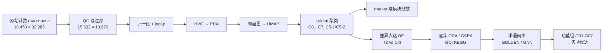

# 小鼠 iNKT 单细胞项目知识库（iNKT scRNA-seq Wiki）

> 面向：计算机背景研究生，生物学停留在高中水平。每个术语都有“通俗解释 + 与本项目的联系”。
> 语言：中文为主，英文术语保留（会议和幻灯片用英文）。文中“（背景知识）”表示来自通用生物学常识，不是项目文件；带文件路径的内容都来自项目文件。

## 这个项目在问什么

**肿瘤（T2 条件）是否改变小鼠骨髓（bone marrow, BM）、脾脏（spleen, Spl）、胸腺（thymus, Thy）中的 iNKT 细胞？** 更具体地：哪些细胞群（cluster）、哪些基因、哪些功能程序在 T2 和对照（Ctrl）之间不同，这些差异是否值得实验合作者（Rob）在台面上验证。（来源：`iNKT_by_date/2026-09-25/README.md`；`docs/inkt_history_and_supervisor_requirements_20260915.md`）

## 数据一览

| 项目 | 内容 | 来源 |
|---|---|---|
| 样本标签 | 6 个 = 3 个组织（BM/Spl/Thy）× 2 个条件（Ctrl/T2） | `docs/inkt_pipeline_stage_by_stage_walkthrough.md` |
| 动物 | 每个标签由 3 只小鼠混合（pooled），即每组 n=1 个 pool | Rob，转录稿 00:37:00；`iNKT_by_date/2026-09-25/README.md` |
| 原始规模 | 18,458 细胞 × 32,285 个基因特征 | 同上 Stage 1 |
| QC 后 | **15,532 细胞 × 10,670 基因**（先 `min_cells=100` 筛基因，再 200≤n_genes<2500、线粒体<5% 筛细胞） | 同上 Stage 2 |
| 各样本 QC 后细胞数 | Ctrl_BM 3,379；Ctrl_Spleen 3,422；Ctrl_Thymus 1,372；T2_BM 2,731；T2_Spleen 3,371；T2_Thymus 1,257 | 同上 Stage 1 |
| 细胞群 | 8 个 Leiden 簇（C0–C7），其中 C5 再拆成 C5-1（812）/C5-2（317） | 同上 5.3；`iNKT_by_date/2026-09-19/results/tables/cell_metadata_scores.csv.gz` |

## 分析流程（Mermaid）

对应概念页：[[单细胞 RNA 测序与 10x 矩阵（scRNA-seq, 10x Matrices: barcodes, features）|scRNA-seq-and-10x-Matrices]] → [[过滤阈值与 min_cells=100（Filtering Thresholds, why Ccr6 was lost）|Filtering-Thresholds]] → [[归一化与 log1p（Normalisation, log1p）|Normalisation-and-log1p]] → [[主成分分析（Principal Component Analysis, PCA）|PCA]] → [[UMAP 降维可视化（UMAP: why position is not physical）|UMAP]] → [[Leiden 聚类（Leiden Clustering）|Leiden-Clustering]] → [[标志基因与模块分数（Marker Genes, Module Scores）|Marker-Genes-and-Module-Scores]] → [[差异表达（Differential Expression, DE; Wilcoxon）|Differential-Expression]] → [[过表征分析（Over-Representation Analysis, ORA; hypergeometric test）|Over-Representation-Analysis]] → [[术语网络（Term Network: nodes = terms, edges = shared genes）|Term-Network]] → [[功能组 G01–G07 及含义（Functional Groups G01–G07）|Functional-Groups-G01-G07]]。

## 从哪里开始读（给计算机背景读者的顺序）

1. **先理解对象**：[[基因、mRNA 与蛋白质（Gene / mRNA / Protein, Central Dogma）|Gene-mRNA-Protein]] → [[细胞类型与细胞状态（Cell Type vs Cell State）|Cell-Type-vs-Cell-State]] → [[iNKT 细胞（invariant Natural Killer T cell）|iNKT-Cell]] → [[iNKT 亚型 iNKT1 / iNKT2 / iNKT17 及其标志基因（iNKT Subsets and Markers）|iNKT-Subsets]] → [[组织：骨髓、脾脏、胸腺（Bone Marrow, Spleen, Thymus）|Tissues-BM-Spleen-Thymus]] → [[白血病 CML / AML 与 “T2” 条件（Leukemia, CML, AML and T2）|Leukemia-CML-AML-and-T2]] → [[小鼠模型与混样（Mouse Model and Pooled Samples）|Mouse-Model-and-Pooled-Samples]]
2. **数据怎么变成图**：[[单细胞 RNA 测序与 10x 矩阵（scRNA-seq, 10x Matrices: barcodes, features）|scRNA-seq-and-10x-Matrices]] → [[计数矩阵（Count Matrix, AnnData）|Count-Matrix]] → [[质量控制指标（QC Metrics: n_genes, total counts, % mitochondrial）|QC-Metrics]] → [[过滤阈值与 min_cells=100（Filtering Thresholds, why Ccr6 was lost）|Filtering-Thresholds]] → [[归一化与 log1p（Normalisation, log1p）|Normalisation-and-log1p]] → [[高变基因（Highly Variable Genes, HVG）|Highly-Variable-Genes]] → [[主成分分析（Principal Component Analysis, PCA）|PCA]] → [[近邻图（Neighbour Graph, k-NN）|Neighbour-Graph]] → [[UMAP 降维可视化（UMAP: why position is not physical）|UMAP]] → [[Leiden 聚类（Leiden Clustering）|Leiden-Clustering]] → [[本项目的簇标签 C0…C7、C5-1 / C5-2（Cluster Labels C0-C7）|Cluster-Labels-C0-C7]]
3. **怎么判断“有差异”**：[[差异表达（Differential Expression, DE; Wilcoxon）|Differential-Expression]] → [[对数倍数变化（Log2 Fold Change, log2FC）|Log2-Fold-Change]] → [[p 值（p-value）|P-value]] → [[多重检验、BH 与 FDR / q 值（Multiple Testing, Benjamini-Hochberg, FDR, q-value）|Multiple-Testing-BH-FDR]] → [[两套筛选阈值：legacy 与 robust（Thresholds: Legacy vs Robust）|Thresholds-Legacy-vs-Robust]] → [[伪重复与 n=1（Pseudoreplication, Why Cell-level p-values Are Not Animal-level Evidence）|Pseudoreplication-and-n-equals-1]]（**最重要的统计边界**）
4. **怎么解读功能**：[[基因本体（Gene Ontology, GO: BP / MF / CC）|Gene-Ontology]] → [[KEGG 通路数据库（KEGG Pathway Database）|KEGG]] → [[过表征分析（Over-Representation Analysis, ORA; hypergeometric test）|Over-Representation-Analysis]] → [[富集不等于激活（Enrichment ≠ Activation）|Enrichment-vs-Activation]] → [[为什么会出现 “measles”、“synapse translation” 这样的名字（Pathway Names Are Not Diseases）|Pathway-Names-Are-Not-Diseases]]
5. **生物学重点**：[[AP-1 转录因子复合体（AP-1: Fos/Jun family）|AP-1-Fos-Jun]] → [[MAPK 级联（MAPK Cascade: ERK, p38, JNK）|MAPK-Cascade]] → [[核糖体与翻译（Ribosome and Translation）|Ribosome-and-Translation]] → [[热休克蛋白、分子伴侣与蛋白折叠（Heat Shock Proteins, Chaperones, Protein Folding: Hsp, Dnaj, CCT）|Heat-Shock-Proteins-and-Chaperones]]
6. **网络与 GNN**：[[术语网络（Term Network: nodes = terms, edges = shared genes）|Term-Network]] → [[GOLDEN 与融合聚类（GOLDEN, Fusion）|GOLDEN]] → [[功能组 G01–G07 及含义（Functional Groups G01–G07）|Functional-Groups-G01-G07]] → [[为什么在 97 节点图上 GNN 增益有限（Why GNN Adds Little on a 97-node Graph）|Why-GNN-Adds-Little]] → [[混合 GO/KEGG 网络分析（Mixed GO/KEGG Network, 2026-09-30）|Mixed-GO-KEGG-Network-0930]] → [[锚点节点（Anchor Nodes）|Anchor-Nodes]] → [[桥接基因（Bridge Genes: Fos, Jun）|Bridge-Genes]] → [[基因层面钻取（Gene-level Drill-down）|Gene-Level-Drilldown]] → [[交互式网络浏览器（Pathway Network Explorer HTML）|Pathway-Network-Explorer-HTML]]
7. **项目现状**：[[目前的主要发现与证据等级（Key Findings so Far）|Key-Findings]] → [[未决问题与下一步（Open Questions and Next Steps）|Open-Questions-and-Next-Steps]] → [[项目时间线（Project Timeline, 09-05 … 09-30）|Project-Timeline]] → [[人物与各自关心的点（Who Is Who）|Who-is-who]]
8. **速查**：[[术语索引（Glossary Index）|Glossary-Index]]、[[概念地图（Concept Map）|Concept-Map]]、[[文档之间看起来不一致或需要核对的地方（Document Inconsistencies and Unsure Points）|Document-Inconsistencies]]

## 三条读图铁律

- 每个 tissue×condition 只有 1 个 pool（n=1）：所有 p 值/FDR 是**细胞层面的探索性统计**，不是动物层面的证据（[[伪重复与 n=1（Pseudoreplication, Why Cell-level p-values Are Not Animal-level Evidence）|Pseudoreplication-and-n-equals-1]]）。
- 富集、评分、mRNA 检出都不是**功能激活**或**蛋白活性**（[[富集不等于激活（Enrichment ≠ Activation）|Enrichment-vs-Activation]]）。
- 簇编号是算法标签，旧 PPT 的 c1 不等于当前的 C1（[[本项目的簇标签 C0…C7、C5-1 / C5-2（Cluster Labels C0-C7）|Cluster-Labels-C0-C7]]）。

## 最新（2026-09-30）

混合 GO/KEGG 网络分析与基因层面钻取已完成：[[混合 GO/KEGG 网络分析（Mixed GO/KEGG Network, 2026-09-30）|Mixed-GO-KEGG-Network-0930]]；相关页面 [[锚点节点（Anchor Nodes）|Anchor-Nodes]]、[[桥接基因（Bridge Genes: Fos, Jun）|Bridge-Genes]]、[[基因层面钻取（Gene-level Drill-down）|Gene-Level-Drilldown]]、[[交互式网络浏览器（Pathway Network Explorer HTML）|Pathway-Network-Explorer-HTML]]。
